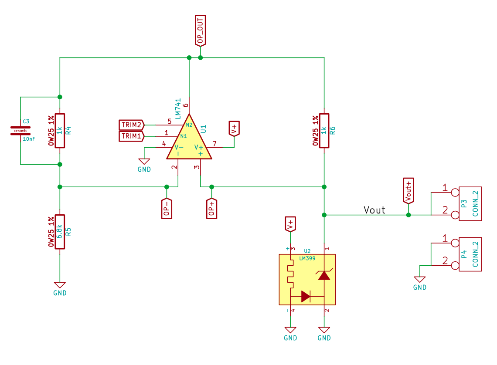
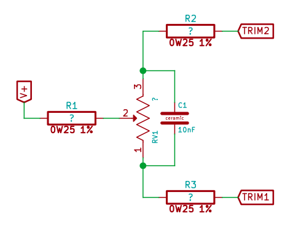

# basic-lm399 v1

This board was designed to be a basic "utility" board for working with the [LM399](http://cds.linear.com/docs/en/datasheet/199399fc.pdf).  Some features which support versatiliy:

- This board supports the use of either single or dual-package DIP-8 op amps (whatever you have on hand!)
- Multiple supply connection options (barrel jack, terminal blocks, or header pins)
- The LM399 footprint supports using a 2x2 header socket, so that LM399's can be quickly swapped and compared.
- For the single op amp footprint, input offset voltage (Vos) trimming circuitry footprints are included (which could be used to make a temporary small adjustment to the final output voltage).
- A "TEST" point is included which can be used with an oscilloscope probe equipped with a [ground spring](https://www.google.com/search?q=oscilloscope+probe+ground+spring&tbm=isch).

This board's dimensions are under 50mm x 50mm, which means it fits in the cheapest pricing tier of most board manufacturers (e.g., in case you'd like to spin a bunch of these boards for bulk LM399 ageging).

## The Circuit

Full schematic: [pdf](trivial-lm399.pdf)

This board uses the basic "bootstrapped zener" concept:

Here's the actual implementation:

## Configurations

This board can be configured in a few ways.

In all configurations, populate the reference,

| Component | Populate | Value |
| --- | ---| --- |
| U2 | ✅ | LM399 |

_Note that a [2x2 0.1" female header](https://www.ebay.com/sch/i.html?_nkw=2x2+2.54mm+female+header) can be used as a socket for quick testing of many LM399's._

populate the feedback resistors,

| Component | Populate | Value |
| --- | ---| --- |
| R4 | ✅ | 1k, 1% metal film |
| R5 | ✅ | 6.8k, 1% metal film |
| R6 | ✅ | 1k, 1% metal film |

populate the supply and feedback capacitors,

| Component | Populate | Value |
| --- | ---| --- |
| C2 | ✅ | 0.1uF, ceramic |
| C3 | ✅ | 10nF, ceramic |

_Note: 0.1uF for C3 will also work if that's all that you have on hand._

and populate your choice of input and output connectors (barrel jack, terminal block, or header pins.

## Basic Single Op Amp Configuration

To use this board with a single op amp, populate the `U1` op amp and leave `U3` op amp unpopulated:

| Component | Populate | Value |
| --- | ---| --- |
| U1 | ✅ | OP07, etc |
| ~~U3~~ | ❌ | |
| ~~R7~~ | ❌ | |
| ~~R8~~ | ❌ | |

Because most single op amps are pin-compatible, this configuration can be used with a number of DIP-8 op amps, e.g.:
- OP07
- LT1001
- TL061, TL071, TL081
- uA741

Leave the Vos trimming circuit unpopulated:

| Component | Populate | Value |
| --- | ---| --- |
| ~~R1~~ | ❌ | |
| ~~R2~~ | ❌ | |
| ~~R3~~ | ❌ | |
| ~~RV1~~ | ❌ | |

Example:

## Single Op Amp Configuration with Vos Trim

In addition to the above components, also populate the input voltage offset (Vos) trimming circuitry.

| Component | Populate | Value |
| --- | ---| --- |
| R1 | ✅ | ??? |
| R2 | ✅ | ??? |
| R3 | ✅ | ??? |
| RV1 | ✅ | ??? |

The component values here can be tailored to your needs, and may require some experimentation to discover.

## Dual op amp configuration

| Component | Populate | Value |
| --- | ---| --- |
| ~~U1~~ | ❌ | |
| ~~U3~~ | ✅ | LM358, etc. |

Because most dual op amps are pin-compatible, this configuration can be used with a number of DIP-8 op amps, e.g.:
- LM358
- TL062, TL072, TL082
- LT1013

You may need to "terminate" the unused op amp:

| Component | Populate | Value |
| --- | ---| --- |
| R7 | ✅ | (any large value, e.g. 100k) |
| R8 | ✅ | (any large value, e.g. 100k) |

Leave the Vos trimming circuit unpopulated:

| Component | Populate | Value |
| --- | ---| --- |
| ~~R1~~ | ❌ | |
| ~~R2~~ | ❌ | |
| ~~R3~~ | ❌ | |
| ~~RV1~~ | ❌ | |

## Start-up issues

With an ideal op amp, this circuit actually has two stable configurations:
- Nominal (7V) output
- 0V output

That is, if the output pin were very slightly negative at start-up, and a rail-to-rail op amp was used, the output could "stick" at 0V and be stable there.

One way to solve this issue is to tie a very high value resistor from output to Vcc, so that some current always flows through the zener, keeping the output positive at all times.

The other way to solve this is to use an op amp which cannot go all the way to 0V output when used in a single-supply configuration (i.e., a non rail-to-rail op amp).  The OP07 fits this bill nicely, as it is fairly precise, and is cheap.  The LT1001 (which is used in the LM399 datasheet circuits) is essentially Linear Tech's upgraded version of the OP07.
